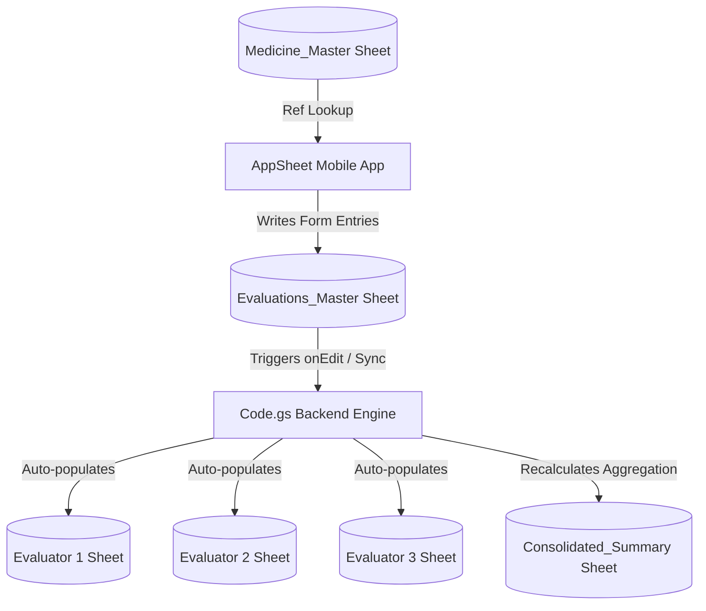
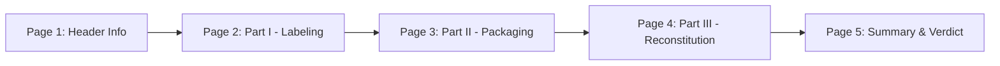

# 📱 AppSheet Setup & Blueprint Guide: Mobile Pharmacy Product Evaluation System

This document provides a step-by-step configuration blueprint for building the **AppSheet Mobile Pharmacy Product Evaluation App** connected to the Google Apps Script backend engine.

---

## 📑 Architecture Overview



---

## 1. 🔌 Data Source Connection & Table Schema Setup

1. Open [AppSheet](https://www.appsheet.com) and click **Create App** → **Start with existing data**.
2. Select **Google Sheets** and connect your target Google Spreadsheet.
3. Add the following **6 Tables**:
   - `Medicine_Master`
   - `Evaluations_Master`
   - `Evaluator 1`
   - `Evaluator 2`
   - `Evaluator 3`
   - `Consolidated_Summary`

### 1.1 Table Column Configurations

#### Table 1: `Medicine_Master`
| Column Name | Type | Key | Label | Formula / Initial Value | Notes |
|---|---|---|---|---|---|
| `Generic_Name` | Text | ✅ | ✅ | - | Master drug generic name |
| `Category_Type` | Text | ❌ | ❌ | `"Pharmaceutical"` | e.g. Antibiotic, Oncology, General |
| `Procurement_Mode` | Enum | ❌ | ❌ | `"Public Bidding"` | Values: Public Bidding, Direct Contracting |

#### Table 2: `Evaluations_Master`
| Column Name | Type | Key | Label | AppSheet Setting / Formula |
|---|---|---|---|---|
| `Evaluation_ID` | Text | ✅ | ❌ | `Initial value`: `UNIQUEID()` |
| `Timestamp` | DateTime | ❌ | ❌ | `Initial value`: `NOW()` |
| `Evaluator` | Enum | ❌ | ❌ | Values: `Evaluator 1`, `Evaluator 2`, `Evaluator 3` |
| `Generic_Name` | Ref | ❌ | ✅ | `Source Table`: `Medicine_Master` |
| `Brand_Name` | Text | ❌ | ❌ | Required |
| `Manufacturer` | Text | ❌ | ❌ | Required |
| `P1_01` to `P1_19` | Enum | ❌ | ❌ | Values: `Yes`, `No`, `N/A` (Buttons) |
| `P2_01` to `P2_06` | Enum | ❌ | ❌ | Values: `Yes`, `No`, `N/A` (Buttons) |
| `Requires_Reconstitution` | Enum | ❌ | ❌ | Values: `Yes`, `No` (Buttons) |
| `P3_01` to `P3_09` | Enum | ❌ | ❌ | Values: `Yes`, `No`, `N/A` (Buttons) |
| `Part_I_Score` | Text / Percent | ❌ | ❌ | Calculated by script / Virtual Column |
| `Part_II_Score` | Text / Percent | ❌ | ❌ | Calculated by script / Virtual Column |
| `Remarks` | LongText | ❌ | ❌ | Optional notes |
| `Recommendation` | Enum | ❌ | ❌ | Values: `Recommended`, `Not Recommended` |

---

## 2. ✂️ AppSheet Slices Setup

Navigate to **Data** → **Slices** and create the following filtered views:

### `Slice_Evaluator1`
- **Source Table**: `Evaluations_Master`
- **Row Filter Condition**:
  ```excel
  [Evaluator] = "Evaluator 1"
  ```

### `Slice_Evaluator2`
- **Source Table**: `Evaluations_Master`
- **Row Filter Condition**:
  ```excel
  [Evaluator] = "Evaluator 2"
  ```

### `Slice_Evaluator3`
- **Source Table**: `Evaluations_Master`
- **Row Filter Condition**:
  ```excel
  [Evaluator] = "Evaluator 3"
  ```

### `Slice_Consensus_Split`
- **Source Table**: `Consolidated_Summary`
- **Row Filter Condition**:
  ```excel
  [Consensus_Status] = "Split Decision"
  ```

---

## 3. 📄 5-Page Mobile Evaluation Form Configuration

Go to **UX** → **Views** → Add View for `Evaluations_Master`:
- **View Name**: `New Evaluation`
- **View Type**: `Form`
- **Page Style**: `Page-by-Page` (5 Tabs / Pages)

### Page Structure & Field Grouping



#### Page 1: Header Info & Identification
- `Evaluator` (Enum Dropdown / Buttons)
- `Generic_Name` (Searchable Dropdown linked to `Medicine_Master`)
- `Brand_Name` (Text field)
- `Manufacturer` (Text field)

#### Page 2: Part I — Labeling & Regulatory Compliance (19 Items)
- Display type: Stacked Yes/No/N/A Segmented Buttons.
- Items covered:
  1. Brand Name Legibility
  2. Generic Name Alignment & Font Size
  3. Dosage Strength & Form
  4. Complete Manufacturer Details
  5. CPR / FDA Registration Number
  6. Batch / Lot Number Visibility
  7. Manufacturing Date
  8. Expiration Date Clarity
  9. Storage Condition Instructions
  10. Rx Symbol / Prescription Warning
  11. Net Content Accuracy
  12. Language & Readability
  13. Outer Box Packaging Integrity
  14. Inner Packaging Foil/Vial Label
  15. Package Insert Availability & Quality
  16. Barcode / QR Scanability
  17. Tamper-Evident Security Seal
  18. Special Handling Warnings
  19. Overall FDA Compliance Standard

#### Page 3: Part II — Physical Packaging & Container Integrity (6 Items)
- Display type: Stacked Yes/No/N/A Buttons.
- Items covered:
  1. Container Integrity (No leaks, cracks, or dents)
  2. Cap / Closure Seal Integrity
  3. Blister Strip Pocket Quality
  4. Physical Appearance (No discoloration/foreign particles)
  5. Dosing Graduation & Syringe Markings
  6. Ease of Opening & Dispensing

#### Page 4: Part III — Reconstitution & Dilution (Conditional Page)
- **Show_If Expression** on Page Header / Field:
  ```excel
  [Requires_Reconstitution] = "Yes"
  ```
- Items covered (9 Items):
  1. Solution Clarity Post-Reconstitution
  2. Time Required for Complete Dissolution
  3. Excessive Foaming / Bubble Retention
  4. Homogeneity & Uniform Color
  5. Diluent Compatibility Verification
  6. Syringe Passability & Viscosity
  7. Post-Reconstitution Storage Labeling
  8. Filter Needle Requirement Alert
  9. Absence of Particulate Matter

#### Page 5: Summary & Verdict
- `Remarks` (LongText field for notes/observations)
- `Recommendation` (Radio Buttons: `Recommended` | `Not Recommended`)

---

## 4. 🧭 UX Navigation Bar Setup

In AppSheet under **UX** → **Views**, set up the bottom navigation bar:

| View Name | Source Data | View Type | Display Icon | Position |
|---|---|---|---|---|
| `New Evaluation` | `Evaluations_Master` | Form | 📝 `file-signature` | Primary (Left) |
| `Evaluator 1` | `Slice_Evaluator1` | Deck | 👤 `user-check` | Primary |
| `Evaluator 2` | `Slice_Evaluator2` | Deck | 👤 `user-check` | Primary |
| `Evaluator 3` | `Slice_Evaluator3` | Deck | 👤 `user-check` | Primary |
| `Consolidated` | `Consolidated_Summary` | Table | 📊 `chart-bar` | Primary (Right) |

---

## 5. 🎨 Format Rules (Color Highlighting)

Go to **UX** → **Format Rules** and create visual indicators:

### Rule 1: Recommended Verdict (Green Badge)
- **For Table**: `Evaluations_Master`
- **If Condition**: `[Recommendation] = "Recommended"`
- **Formatting**:
  - Text Color: `#1E8449` (Dark Green)
  - Highlight Fill: `#D4EFDF` (Light Green)
  - Icon: `check-circle`

### Rule 2: Not Recommended Verdict (Red Badge)
- **For Table**: `Evaluations_Master`
- **If Condition**: `[Recommendation] = "Not Recommended"`
- **Formatting**:
  - Text Color: `#C0392B` (Dark Red)
  - Highlight Fill: `#FADBD8` (Light Red)
  - Icon: `times-circle`

### Rule 3: Split Decision Alert (Amber Highlight)
- **For Table**: `Consolidated_Summary`
- **If Condition**: `[Consensus_Status] = "Split Decision"`
- **Formatting**:
  - Text Color: `#B7950B` (Dark Gold)
  - Highlight Fill: `#FCF3CF` (Light Amber)
  - Icon: `exclamation-triangle`

---

## 6. 🧮 AppSheet Virtual Columns (Score Calculation Expressions)

If you wish to show the calculated percentage scores live inside AppSheet *before* saving to Google Sheets, add two **Virtual Columns** in `Evaluations_Master`:

### Virtual Column `[Part_I_Score_VC]`
- **App Formula**:
  ```excel
  CONCATENATE(
    ROUND(
      (
        COUNT(FILTER(LIST([P1_01], [P1_02], [P1_03], [P1_04], [P1_05], [P1_06], [P1_07], [P1_08], [P1_09], [P1_10], [P1_11], [P1_12], [P1_13], [P1_14], [P1_15], [P1_16], [P1_17], [P1_18], [P1_19]), [_THIS] = "Yes"))
        /
        MAX(LIST(1, 19 - COUNT(FILTER(LIST([P1_01], [P1_02], [P1_03], [P1_04], [P1_05], [P1_06], [P1_07], [P1_08], [P1_09], [P1_10], [P1_11], [P1_12], [P1_13], [P1_14], [P1_15], [P1_16], [P1_17], [P1_18], [P1_19]), [_THIS] = "N/A"))))
      ) * 100, 1
    ), "%"
  )
  ```

### Virtual Column `[Part_II_Score_VC]`
- **App Formula**:
  ```excel
  CONCATENATE(
    ROUND(
      (
        COUNT(FILTER(LIST([P2_01], [P2_02], [P2_03], [P2_04], [P2_05], [P2_06]), [_THIS] = "Yes"))
        /
        MAX(LIST(1, 6 - COUNT(FILTER(LIST([P2_01], [P2_02], [P2_03], [P2_04], [P2_05], [P2_06]), [_THIS] = "N/A"))))
      ) * 100, 1
    ), "%"
  )
  ```

---

## 7. 🔐 User Identity & Security (Optional)

To restrict evaluators to seeing only their assigned evaluations:
1. In `Slice_Evaluator1`, change the Security Filter:
   ```excel
   [Evaluator] = "Evaluator 1" AND ([UserEmail] = USEREMAIL())
   ```
2. Set up user settings or email mapping table for authorization.

---

## 8. ⚡ Testing & Verification Checklist

- [ ] Verify `Generic_Name` dropdown correctly displays all drugs from `Medicine_Master`.
- [ ] Test 5-page navigation in mobile preview mode.
- [ ] Verify Part III page hides when `Requires_Reconstitution` is set to "No".
- [ ] Save an evaluation record and verify it writes to `Evaluations_Master`.
- [ ] Check that `Code.gs` script triggers automatically, populates the respective `Evaluator X` sheet, and updates `Consolidated_Summary`.

---

## 9. 📑 Automated Printable Checklist Viewer (`Checklist_Report`)

Whenever evaluators submit assessments through AppSheet, you can instantly plot and print the official audit-ready **Product Evaluation Checklist**:

1. In your Google Spreadsheet, open the custom menu:
   * **`🏥 PPMP Evaluation`** → **`📑 Initialize / Reset Printable Checklist Viewer`**.
2. A new tab named **`Checklist_Report`** will be generated with the hospital's exact official layout:
   * **Cell C3 (`Select Drug`)**: Pick any drug generic name from the dropdown.
   * **Cell F3 (`Select Evaluator`)**: Pick `Evaluator 1`, `Evaluator 2`, or `Evaluator 3`.
3. **Instant Live Plotting**:
   * All 19 Part I items and Part II items automatically display **`☑`** (checked box) under the respective **Yes**, **No**, or **N/A** column based on what was evaluated in AppSheet!
   * Automatically pulls Supplier Name, Generic Name, Brand Name, Part I Score (%), Part II Score (%), Remarks, and Recommendation.
4. **Printing / PDF**:
   * Press **`Ctrl + P`** to print directly or save as PDF.
   * Or click **`🏥 PPMP Evaluation`** → **`📄 Export Current Checklist to PDF`** to generate a direct PDF copy into your Google Drive.

---

## 10. 📊 Clean Horizontal Evaluation Report Tab (`Checklist_Report_Horizontal`)

For committee presentations, audit logs, and spreadsheet reporting across all evaluations:

1. Click **`🏥 PPMP Evaluation`** → **`📊 Initialize / Refresh Horizontal Report`**.
2. A new tab named **`Checklist_Report_Horizontal`** is generated with:
   * **Human-Readable Headers**: Grouped headers for *Identification & Metadata*, *Part I (19 Official Criteria)*, *Part II (6 Criteria)*, and *Verdict & Scores*.
   * **Clean Checkmarks**: Transforms raw database strings into clean presentation symbols (`✓` for Yes, `✗` for No, `—` for N/A).
   * **Evaluator Names**: Auto-populates full evaluator names from `Evaluator_Accounts`.
   * **Color Badges**: Highlights Recommended (🟩) and Not Recommended (🟥) verdicts.
   * **Frozen Panes**: Columns A–D and Rows 1–2 are frozen for smooth horizontal matrix scrolling.


